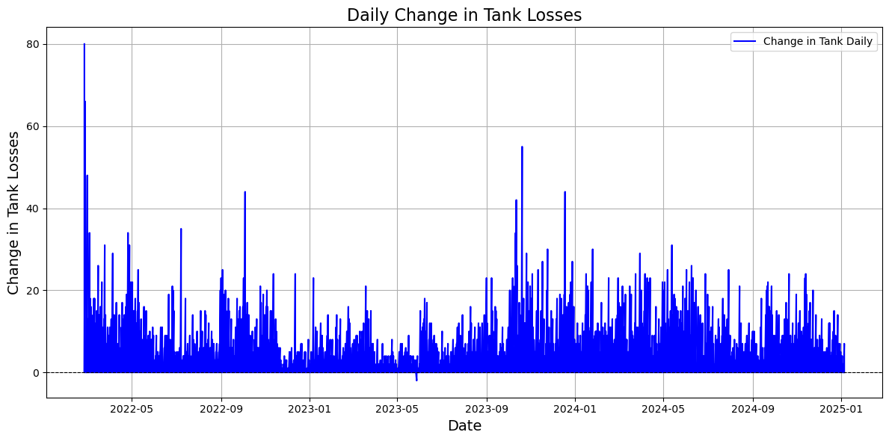
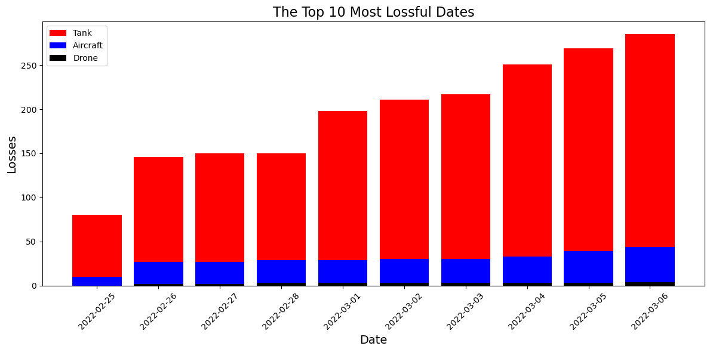

# Russia–Ukraine War Losses (2022) — Data Analysis & SQL

An end-to-end data-analysis project on **daily Russian equipment and personnel
losses** during 2022: cleaning and integrating multiple datasets, loading them
into a **relational SQLite database**, and running exploratory analysis to
surface trends.

## What it does

```
3 raw CSVs (equipment, equipment-correction, personnel)
   ─► clean, type-cast, integrate (pandas)
   ─► build a relational SQLite database (3 tables, keyed on date)
   ─► query + EDA ─► trend visualisations (Matplotlib / Seaborn)
```

## Highlights

- **Data engineering** — three separate loss datasets cleaned and merged on date,
  then persisted as a normalised SQLite schema (`Russia_Losses_Equipment`,
  `Russia_Losses_Equipment_Correction`, `Russia_Losses_Personnel`).
- **SQL + Python** — tables created and loaded via `sqlite3`, then queried back
  into pandas for analysis.
- **EDA** — cumulative and daily loss trends across equipment categories and
  personnel, visualised over the 2022 timeline.

## Files

| File | Contents |
|---|---|
| `russia_losses_equipment.csv` | Daily equipment losses by category |
| `russia_losses_equipment_correction.csv` | Correction series |
| `russia_losses_personnel.csv` | Daily personnel losses |
| `*.db` | Generated SQLite database |
| `*.ipynb` | Cleaning, DB build, and analysis notebook |

## Selected outputs

**Daily change in tank losses** — reported daily tank losses over the conflict,
showing an intense early-war spike followed by sustained, noisy attrition.



**Top 10 most lossful dates** — the highest-loss days, broken down by equipment
type (tanks dominate, with aircraft and drones layered in).



## Tech stack

Python · pandas · **SQLite (sqlite3)** · Matplotlib · Seaborn

## Run

Open the notebook and run top to bottom; it rebuilds the SQLite database from the
CSVs and regenerates all charts.

> Data source: publicly published 2022 Russia–Ukraine equipment/personnel loss
> datasets. This is an analytical/educational project.
